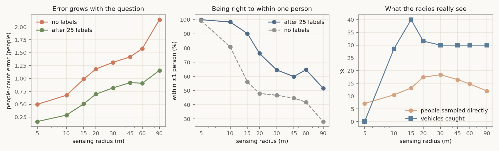

# The sensing radius: what it costs you

Generated by `validation/radius.py` + `radius_report.py`.
Reproduce with `python3 radius.py && python3 radius_report.py`.

## The question

The app answers *"how many people are within R metres?"*. R is a choice, and it is
not a free one: it trades absolute error against coverage, and past a point it stops
buying anything at all. This experiment measures that trade-off instead of guessing
it. Every number below is 10 simulated street scenes x 300 s, the shipping
estimator, truth = "targets whose distance to the phone is <= R at this instant".

## Accuracy per radius

| radius | name | people really there | error, no labels | error, 25 labels | within ±1 | crowd sampled directly | vehicles caught |
|---|---|---|---|---|---|---|---|
| 5 m | Arm's length | 0.13 | ±0.50 | ±0.16 | 100% | 7% | 0% |
| 10 m | Room | 0.41 | ±0.67 | ±0.29 | 98% | 10% | 29% |
| 15 m | Pavement | 0.99 | ±0.99 | ±0.51 | 90% | 13% | 40% |
| 20 m | Frontage | 1.90 | ±1.18 | ±0.70 | 76% | 17% | 32% |
| 30 m | Street | 2.77 | ±1.31 | ±0.82 | 65% | 18% | 30% |
| 45 m | Crossroads | 3.36 | ±1.42 | ±0.92 | 60% | 17% | 30% |
| 60 m | Square | 3.91 | ±1.58 | ±0.91 | 65% | 15% | 30% |
| 90 m | Horizon | 4.91 | ±2.14 | ±1.16 | 52% | 12% | 30% |

Read the table in two directions:

* **Down the first columns** — every extra metre of radius costs accuracy. Absolute
  error roughly doubles from 5 m to 90 m, and the chance of being right to within one
  person falls from ~100% to ~52%. Asking about a bigger region is asking a harder
  question, not getting a better instrument.
* **Across to the last columns** — the fraction of the crowd the radios *sample
  directly* peaks at 30 m (18%) and then falls, because at 2.4 GHz a phone simply
  cannot hear another phone much beyond ~15 m. Beyond 30 m the count is inference,
  not measurement: the calibrated model extrapolates from the slice it can see.

Two non-monotonic details worth knowing. Vehicle detection *peaks at 15 m* (40%):
a car passing close gives a clean, fast, hyperbolic range curve, while a car 40 m
away gives you two or three noisy samples. And below 10 m the count is mostly
infrastructure — beacons, laptops, parked-car sensors — not people, which is why the
"crowd sampled directly" share collapses to 7% at 5 m even though the absolute error
is at its best.

## Two laws that came out of it

**The RF prior scales with the square root of the radius, not its area.**
The device-free Wi-Fi channel sees a volume set by where the access points are, not
by the radius you asked about. Sweeping the multiplier per radius gives
alpha(R) = (R/25)^**0.505** (rms log residual 0.138 over 8 radii):

| R | 5 | 10 | 15 | 20 | 30 | 45 | 60 | 90 |
|---|---|---|---|---|---|---|---|---|
| measured best | 0.5 | 0.75 | 0.75 | 1.0 | 1.0 | 1.5 | 1.5 | 2.5 |
| fitted | 0.44 | 0.63 | 0.77 | 0.89 | 1.10 | 1.35 | 1.56 | 1.91 |

**The learned correction needs a unit conversion.** The RLS model predicts an
absolute headcount, so its residual is in the units of whichever radius it was
trained at. Fitting RMS(residual) against R gives s(R) = (R/25)^**0.481**.
Divide the training residual by it, multiply the prediction by it, and labels become
portable between radii.

## Does calibration survive a radius change?

No — and that is worth knowing before you promise the user otherwise. Training 25
labels at one radius and evaluating at another:

| train → test | model, unscaled | model, rescaled by s(R) | no model (rules only) | model trained at the test radius |
|---|---|---|---|---|
| 15 m → 45 m | 1.57 | 2.08 | 1.34 | 1.01 |
| 45 m → 15 m | 1.52 | 1.11 | 0.86 | 0.52 |
| 10 m → 60 m | 1.67 | 2.49 | 1.35 | 0.98 |
| 60 m → 10 m | 1.98 | 1.15 | 0.61 | 0.29 |

In **every** pair we tested, carrying the old model across is worse than dropping it
and falling back to the physics baseline. The rescaling law helps a lot when you
*shrink* the radius (45→15 m: 1.52 → 1.11) and hurts when you *grow* it
(15→45 m: 1.57 → 2.08), because growing amplifies a correction whose features no
longer match. So the app's behaviour on a radius change is: keep the weights as a
warm start, drop trust to zero, re-earn it with labels at the new radius. Nothing the
user labelled is thrown away — the labels stay in the database and in the Accuracy
tab.

## Limits of these numbers

* Simulated scenes, not a field trial: 10 pedestrians, 5 vehicles and ~22 static
  beacons per 5-minute scene, one radio environment (`urban`, path-loss exponent
  2.9). The *shape* of the trade-off is physics and should hold; the absolute
  numbers will move with real hardware, real MAC-rotation rates and real clutter.
* "Crowd sampled directly" is measured against simulated people, ~86% of whom carry
  a discoverable BLE device. Real carry rates are place- and time-dependent, which is
  exactly what the calibration exists to absorb.
* Standing people are the weakest case: they are easily mistaken for infrastructure
  and are counted at reduced weight, so a still crowd is under-counted at every
  radius.
